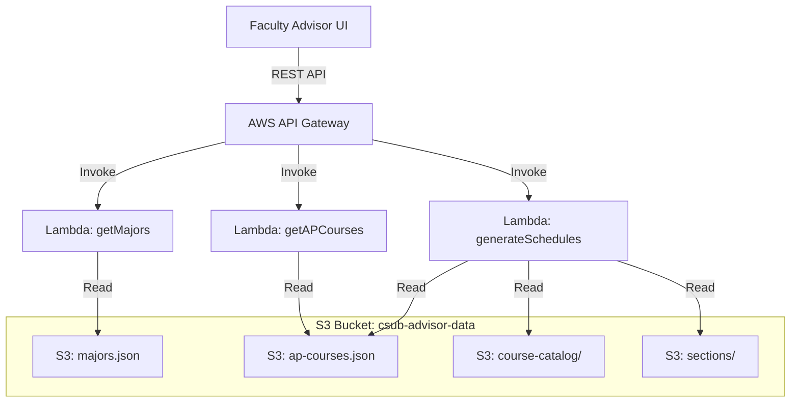
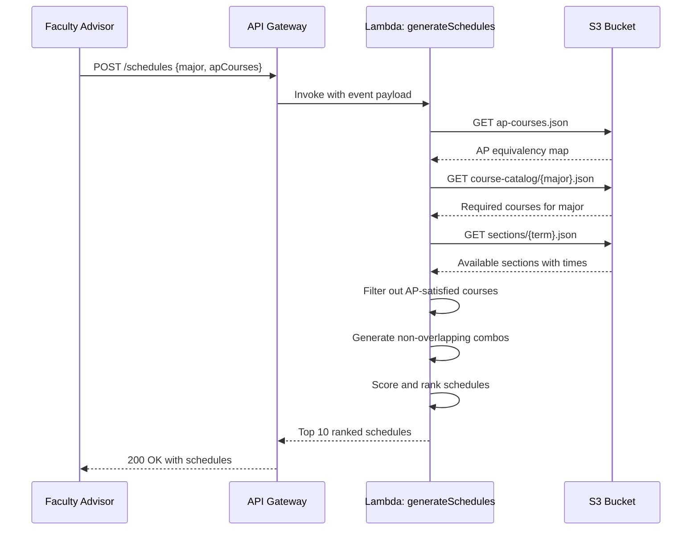
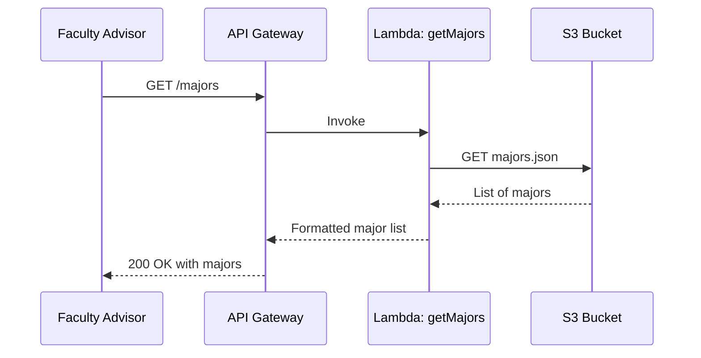

# Design Document: CSUB Faculty Freshman Advisor Backend

## Overview

This backend system supports CSUB (California State University, Bakersfield) faculty freshman advisors by generating optimized, non-overlapping course schedules for incoming freshmen. Faculty advisors select a student's intended major and any AP credits earned, and the system returns up to 10 ranked schedule options. Each schedule is scored (1-5) based on compactness, time-of-day alignment (morning preference), and day distribution (fewer days preferred).

The system is fully serverless, built on AWS Lambda for compute, API Gateway for REST endpoints, and S3 for persistent data storage (course catalogs, schedule templates, and AP equivalency mappings).

## Architecture



## Sequence Diagrams

### Schedule Generation Flow



### Major Selection Flow



## Components and Interfaces

### Component 1: API Gateway (REST Layer)

**Purpose**: Exposes RESTful endpoints for the frontend, handles request validation, CORS, and routes to Lambda functions.

**Endpoints**:

| Method | Path | Lambda | Description |
|--------|------|--------|-------------|
| GET | /majors | getMajors | Returns all available freshman majors |
| GET | /ap-courses | getAPCourses | Returns all 40 College Board AP courses |
| POST | /schedules | generateSchedules | Generates ranked schedule options |

**Responsibilities**:
- Request/response transformation
- Input validation via request models
- CORS configuration for frontend access
- Rate limiting and throttling

### Component 2: Lambda - getMajors

**Purpose**: Retrieves the list of all CSUB majors available to freshmen.

**Interface**:
```pascal
PROCEDURE getMajors(event)
  INPUT: event (API Gateway proxy event, no body required)
  OUTPUT: Response with list of majors
END PROCEDURE
```

**Responsibilities**:
- Read majors.json from S3
- Return formatted list with major code and display name

### Component 3: Lambda - getAPCourses

**Purpose**: Retrieves the full list of 40 College Board AP courses with their CSUB equivalencies.

**Interface**:
```pascal
PROCEDURE getAPCourses(event)
  INPUT: event (API Gateway proxy event, no body required)
  OUTPUT: Response with list of AP courses and CSUB equivalencies
END PROCEDURE
```

**Responsibilities**:
- Read ap-courses.json from S3
- Return AP course names, codes, and CSUB course equivalencies

### Component 4: Lambda - generateSchedules

**Purpose**: Core logic. Takes major + AP credits, determines required courses, finds available sections, generates non-overlapping schedule combinations, scores them, and returns ranked results.

**Interface**:
```pascal
PROCEDURE generateSchedules(event)
  INPUT: event containing body {majorCode: String, apCourses: List of String, term: String}
  OUTPUT: Response with up to 10 ranked schedule objects
END PROCEDURE
```

**Responsibilities**:
- Parse request body for major code, selected AP courses, and term
- Load AP equivalency map and determine satisfied courses
- Load required freshman courses for the selected major
- Filter out courses already satisfied by AP credit
- Load available sections with time slots
- Generate all valid (non-overlapping) schedule combinations
- Score each schedule on compactness, time alignment, and day distribution
- Return top 10 schedules ranked 1-5

### Component 5: S3 Bucket (Data Store)

**Purpose**: Persistent storage for all reference data - majors, AP mappings, course catalogs, and section schedules.

**Bucket Structure**:
```
csub-advisor-data/
├── majors.json
├── ap-courses.json
├── course-catalog/
│   ├── CS.json
│   ├── BIOL.json
│   ├── ENG.json
│   └── ... (one file per major)
└── sections/
    ├── fall-2025.json
    ├── spring-2026.json
    └── ... (one file per term)
```

**Responsibilities**:
- Store and serve static reference data
- Versioned via S3 versioning for audit trail
- Updated by administrative process (outside this system scope)

## Data Models

### Major

```pascal
STRUCTURE Major
  code: String          // e.g., "CS", "BIOL", "ENG"
  name: String          // e.g., "Computer Science", "Biology"
  department: String    // e.g., "School of Natural Sciences"
  freshmanCourses: List of String  // Course codes required in freshman year
END STRUCTURE
```

### AP Course

```pascal
STRUCTURE APCourse
  code: String            // e.g., "AP-CSA", "AP-CALC-AB"
  name: String            // e.g., "AP Computer Science A"
  csubEquivalent: String  // e.g., "CMPS 2010" or NULL if no equivalent
  creditHours: Integer    // Credits awarded if passed
  minScore: Integer       // Minimum AP score for credit (typically 3-5)
END STRUCTURE
```

### Course Section

```pascal
STRUCTURE Section
  sectionId: String       // e.g., "CMPS-2010-01"
  courseCode: String      // e.g., "CMPS 2010"
  courseName: String     // e.g., "Introduction to Computer Science"
  instructor: String
  days: List of String   // e.g., ["Mon", "Wed", "Fri"]
  startTime: Integer     // Minutes from midnight, e.g., 480 = 8:00 AM
  endTime: Integer       // Minutes from midnight, e.g., 530 = 8:50 AM
  location: String
  capacity: Integer
  enrolled: Integer
  term: String           // e.g., "fall-2025"
END STRUCTURE
```

### Schedule

```pascal
STRUCTURE Schedule
  id: String
  sections: List of Section
  score: Float           // 1.0 to 5.0
  rank: Integer          // 1 to 10
  breakdown: ScoreBreakdown
END STRUCTURE

STRUCTURE ScoreBreakdown
  compactness: Float       // 1.0 to 5.0
  timeAlignment: Float     // 1.0 to 5.0
  dayDistribution: Float   // 1.0 to 5.0
END STRUCTURE
```

**Validation Rules**:
- majorCode must exist in majors.json
- apCourses list items must be valid AP course codes
- No two sections in a schedule can have overlapping time slots on the same day
- Score must be between 1.0 and 5.0 inclusive
- Schedule must contain at least 1 section

## Algorithmic Pseudocode

### Main Schedule Generation Algorithm

```pascal
ALGORITHM generateSchedules(majorCode, apCourses, term)
INPUT: majorCode (String), apCourses (List of String), term (String)
OUTPUT: rankedSchedules (List of Schedule, max 10)

BEGIN
  // Step 1: Load reference data from S3
  apMap ← loadFromS3("ap-courses.json")
  majorData ← loadFromS3("course-catalog/" + majorCode + ".json")
  sections ← loadFromS3("sections/" + term + ".json")

  // Step 2: Determine which courses AP credits satisfy
  satisfiedCourses ← EMPTY SET
  FOR EACH apCode IN apCourses DO
    apCourse ← apMap.find(apCode)
    IF apCourse IS NOT NULL AND apCourse.csubEquivalent IS NOT NULL THEN
      satisfiedCourses.add(apCourse.csubEquivalent)
    END IF
  END FOR

  // Step 3: Get required courses minus AP-satisfied ones
  requiredCourses ← majorData.freshmanCourses
  remainingCourses ← requiredCourses.filter(c => c NOT IN satisfiedCourses)

  // Step 4: Find available sections for remaining courses
  availableSections ← EMPTY MAP (courseCode -> List of Section)
  FOR EACH courseCode IN remainingCourses DO
    matchingSections ← sections.filter(s => s.courseCode = courseCode AND s.enrolled < s.capacity)
    IF matchingSections IS NOT EMPTY THEN
      availableSections[courseCode] ← matchingSections
    END IF
  END FOR

  // Step 5: Generate non-overlapping combinations
  combinations ← generateCombinations(availableSections)

  // Step 6: Score and rank
  scoredSchedules ← EMPTY LIST
  FOR EACH combo IN combinations DO
    score ← computeScore(combo)
    scoredSchedules.add(Schedule(combo, score))
  END FOR

  // Step 7: Sort by score descending, take top 10
  scoredSchedules.sortDescending(by: score)
  rankedSchedules ← scoredSchedules.take(10)

  // Assign ranks 1-10
  FOR i FROM 0 TO rankedSchedules.length - 1 DO
    rankedSchedules[i].rank ← i + 1
  END FOR

  RETURN rankedSchedules
END
```

**Preconditions:**
- majorCode exists in course-catalog S3 directory
- apCourses contains only valid AP course codes
- term corresponds to an existing sections file in S3
- S3 bucket is accessible and data files are well-formed JSON

**Postconditions:**
- Returns 0 to 10 schedules
- All returned schedules have zero time conflicts
- Schedules are sorted by score descending
- Each schedule has a rank from 1 to N where N <= 10

**Loop Invariants:**
- In Step 2: satisfiedCourses contains only valid CSUB course codes with confirmed AP equivalencies
- In Step 4: availableSections maps only to sections with remaining capacity
- In Step 6: all schedules in scoredSchedules are conflict-free

### Combination Generation Algorithm

```pascal
ALGORITHM generateCombinations(availableSections)
INPUT: availableSections (Map: courseCode -> List of Section)
OUTPUT: validCombinations (List of List of Section)

BEGIN
  courseKeys ← availableSections.keys()
  IF courseKeys IS EMPTY THEN
    RETURN EMPTY LIST
  END IF

  validCombinations ← EMPTY LIST
  currentCombo ← EMPTY LIST

  CALL buildCombos(courseKeys, 0, currentCombo, validCombinations, availableSections)

  RETURN validCombinations
END

PROCEDURE buildCombos(courseKeys, index, currentCombo, results, availableSections)
  // Base case: all courses assigned
  IF index = courseKeys.length THEN
    results.add(copy(currentCombo))
    RETURN
  END IF

  courseCode ← courseKeys[index]
  sections ← availableSections[courseCode]

  FOR EACH section IN sections DO
    IF NOT hasConflict(section, currentCombo) THEN
      currentCombo.add(section)
      CALL buildCombos(courseKeys, index + 1, currentCombo, results, availableSections)
      currentCombo.removeLast()
    END IF
  END FOR
END PROCEDURE
```

**Preconditions:**
- availableSections is non-empty map with at least one course having sections
- All sections have valid startTime and endTime values

**Postconditions:**
- Every combination in validCombinations contains exactly one section per course
- No combination contains overlapping time slots on the same day

**Loop Invariants:**
- currentCombo never contains conflicting sections at any recursive depth
- results only contains fully-formed, conflict-free combinations

### Time Conflict Detection

```pascal
ALGORITHM hasConflict(newSection, existingSections)
INPUT: newSection (Section), existingSections (List of Section)
OUTPUT: conflictExists (Boolean)

BEGIN
  FOR EACH existing IN existingSections DO
    // Check if they share any common days
    commonDays ← intersection(newSection.days, existing.days)
    IF commonDays IS NOT EMPTY THEN
      // Check time overlap on shared days
      IF newSection.startTime < existing.endTime AND newSection.endTime > existing.startTime THEN
        RETURN TRUE
      END IF
    END IF
  END FOR
  RETURN FALSE
END
```

**Preconditions:**
- newSection has valid days list and startTime < endTime
- All sections in existingSections have valid days and times

**Postconditions:**
- Returns TRUE if and only if newSection overlaps in time with any existing section on a shared day
- No mutations to input parameters

### Schedule Scoring Algorithm

```pascal
ALGORITHM computeScore(sections)
INPUT: sections (List of Section)
OUTPUT: finalScore (Float, 1.0 to 5.0), breakdown (ScoreBreakdown)

BEGIN
  compactnessScore ← computeCompactness(sections)
  timeAlignmentScore ← computeTimeAlignment(sections)
  dayDistributionScore ← computeDayDistribution(sections)

  // Weighted average: compactness 30%, time alignment 40%, day distribution 30%
  finalScore ← (compactnessScore * 0.30) + (timeAlignmentScore * 0.40) + (dayDistributionScore * 0.30)

  breakdown ← ScoreBreakdown(compactnessScore, timeAlignmentScore, dayDistributionScore)

  RETURN finalScore, breakdown
END

ALGORITHM computeCompactness(sections)
INPUT: sections (List of Section)
OUTPUT: score (Float, 1.0 to 5.0)

BEGIN
  totalGapMinutes ← 0
  classDayCount ← 0

  // Group sections by day
  FOR EACH day IN ["Mon", "Tue", "Wed", "Thu", "Fri"] DO
    daySections ← sections.filter(s => day IN s.days)
    IF daySections.length > 1 THEN
      classDayCount ← classDayCount + 1
      // Sort by start time
      daySections.sortAscending(by: startTime)
      // Sum gaps between consecutive classes
      FOR i FROM 0 TO daySections.length - 2 DO
        gap ← daySections[i + 1].startTime - daySections[i].endTime
        totalGapMinutes ← totalGapMinutes + gap
      END FOR
    END IF
  END FOR

  IF classDayCount = 0 THEN
    RETURN 5.0  // Single class per day, perfectly compact
  END IF

  avgGap ← totalGapMinutes / classDayCount

  // Score: 0 min gap = 5.0, 180+ min gap = 1.0
  score ← 5.0 - (avgGap / 180.0) * 4.0
  score ← clamp(score, 1.0, 5.0)

  RETURN score
END

ALGORITHM computeTimeAlignment(sections)
INPUT: sections (List of Section)
OUTPUT: score (Float, 1.0 to 5.0)

BEGIN
  morningCount ← 0    // 7:00 AM - 11:59 AM (420 - 719)
  afternoonCount ← 0  // 12:00 PM - 4:59 PM (720 - 1019)
  eveningCount ← 0    // 5:00 PM - 9:00 PM (1020 - 1260)

  FOR EACH section IN sections DO
    IF section.startTime >= 420 AND section.startTime < 720 THEN
      morningCount ← morningCount + 1
    ELSE IF section.startTime >= 720 AND section.startTime < 1020 THEN
      afternoonCount ← afternoonCount + 1
    ELSE
      eveningCount ← eveningCount + 1
    END IF
  END FOR

  totalSections ← sections.length
  morningRatio ← morningCount / totalSections

  // Freshmen prefer morning classes
  // 100% morning = 5.0, 0% morning = 1.0
  // Afternoon gets partial credit, evening gets least
  afternoonRatio ← afternoonCount / totalSections
  score ← (morningRatio * 5.0) + (afternoonRatio * 3.0) + ((eveningCount / totalSections) * 1.5)
  score ← clamp(score, 1.0, 5.0)

  RETURN score
END

ALGORITHM computeDayDistribution(sections)
INPUT: sections (List of Section)
OUTPUT: score (Float, 1.0 to 5.0)

BEGIN
  // Count unique days with classes
  activeDays ← EMPTY SET
  FOR EACH section IN sections DO
    FOR EACH day IN section.days DO
      activeDays.add(day)
    END FOR
  END FOR

  numDays ← activeDays.size

  // Scoring: fewer days = better
  // 2 days (e.g., Tue/Thu) = 5.0
  // 3 days (e.g., Mon/Wed/Fri) = 4.5
  // 4 days = 3.0
  // 5 days = 1.5
  SWITCH numDays
    CASE 1: score ← 5.0
    CASE 2: score ← 5.0
    CASE 3: score ← 4.5
    CASE 4: score ← 3.0
    CASE 5: score ← 1.5
    DEFAULT: score ← 1.0
  END SWITCH

  RETURN score
END
```

**Preconditions:**
- sections list is non-empty
- All sections have valid startTime (420-1260) and endTime values
- startTime < endTime for all sections

**Postconditions:**
- finalScore is between 1.0 and 5.0 inclusive
- Each sub-score in breakdown is between 1.0 and 5.0 inclusive
- Higher scores indicate more desirable schedules

**Loop Invariants:**
- In computeCompactness: totalGapMinutes accumulates only positive gap values
- In computeTimeAlignment: morningCount + afternoonCount + eveningCount = number of sections processed so far
- In computeDayDistribution: activeDays contains only valid day strings

## Key Functions with Formal Specifications

### Function 1: getMajorsHandler()

```pascal
PROCEDURE getMajorsHandler(event)
  INPUT: event (API Gateway proxy event)
  OUTPUT: HTTP Response {statusCode: 200, body: JSON list of majors}
END PROCEDURE
```

**Preconditions:**
- S3 bucket "csub-advisor-data" is accessible
- File "majors.json" exists and is valid JSON

**Postconditions:**
- Returns 200 with JSON array of Major objects
- Returns 500 with error message if S3 read fails
- Response includes CORS headers

### Function 2: getAPCoursesHandler()

```pascal
PROCEDURE getAPCoursesHandler(event)
  INPUT: event (API Gateway proxy event)
  OUTPUT: HTTP Response {statusCode: 200, body: JSON list of AP courses}
END PROCEDURE
```

**Preconditions:**
- S3 bucket "csub-advisor-data" is accessible
- File "ap-courses.json" exists and contains all 40 AP courses

**Postconditions:**
- Returns 200 with JSON array of APCourse objects
- Array contains exactly 40 entries (all College Board AP courses)
- Returns 500 with error message if S3 read fails

### Function 3: generateSchedulesHandler()

```pascal
PROCEDURE generateSchedulesHandler(event)
  INPUT: event with body {majorCode: String, apCourses: List of String, term: String}
  OUTPUT: HTTP Response {statusCode: 200, body: JSON list of ranked schedules}
END PROCEDURE
```

**Preconditions:**
- Request body is valid JSON with required fields
- majorCode corresponds to a valid major in course-catalog/
- All items in apCourses are valid AP course codes
- term corresponds to an existing sections file

**Postconditions:**
- Returns 200 with 0 to 10 Schedule objects
- All schedules are conflict-free (no time overlaps)
- Schedules are ordered by score descending
- Returns 400 if request body validation fails
- Returns 404 if major or term not found
- Returns 500 for unexpected errors

### Function 4: hasConflict()

```pascal
PROCEDURE hasConflict(newSection, existingSections)
  INPUT: newSection (Section), existingSections (List of Section)
  OUTPUT: Boolean
END PROCEDURE
```

**Preconditions:**
- newSection has valid days, startTime, and endTime
- All existingSections have valid days, startTime, and endTime
- For all sections: startTime < endTime

**Postconditions:**
- Returns TRUE iff there exists a section in existingSections that shares a day with newSection AND their time intervals overlap
- No mutation of inputs

### Function 5: computeScore()

```pascal
PROCEDURE computeScore(sections)
  INPUT: sections (List of Section, non-empty)
  OUTPUT: score (Float), breakdown (ScoreBreakdown)
END PROCEDURE
```

**Preconditions:**
- sections is non-empty
- All sections have valid time data
- No overlapping sections exist in the input list

**Postconditions:**
- score is in range [1.0, 5.0]
- breakdown.compactness is in range [1.0, 5.0]
- breakdown.timeAlignment is in range [1.0, 5.0]
- breakdown.dayDistribution is in range [1.0, 5.0]
- score = 0.30 * compactness + 0.40 * timeAlignment + 0.30 * dayDistribution

## Example Usage

```pascal
// Example 1: Faculty advisor requests schedule for CS major with AP credits
SEQUENCE
  request ← {
    majorCode: "CS",
    apCourses: ["AP-CSA", "AP-CALC-AB", "AP-ENG-LANG"],
    term: "fall-2025"
  }

  response ← POST "/schedules" WITH request

  // Response contains up to 10 ranked schedules
  // Each schedule has non-overlapping sections and a score
  DISPLAY response.schedules[0]
  // Output:
  // {
  //   rank: 1,
  //   score: 4.7,
  //   breakdown: { compactness: 4.5, timeAlignment: 5.0, dayDistribution: 4.5 },
  //   sections: [
  //     { courseCode: "CMPS 2020", days: ["Mon", "Wed", "Fri"], startTime: 480, endTime: 530 },
  //     { courseCode: "MATH 2510", days: ["Mon", "Wed", "Fri"], startTime: 540, endTime: 590 },
  //     { courseCode: "PHYS 2010", days: ["Tue", "Thu"], startTime: 480, endTime: 555 }
  //   ]
  // }
END SEQUENCE

// Example 2: Get list of majors for dropdown
SEQUENCE
  response ← GET "/majors"
  // Returns: [{ code: "CS", name: "Computer Science" }, { code: "BIOL", name: "Biology" }, ...]
END SEQUENCE

// Example 3: Get AP courses for selection bank
SEQUENCE
  response ← GET "/ap-courses"
  // Returns all 40 AP courses with CSUB equivalencies
  // [{ code: "AP-CSA", name: "AP Computer Science A", csubEquivalent: "CMPS 2010", minScore: 3 }, ...]
END SEQUENCE

// Example 4: Major with no AP credits
SEQUENCE
  request ← {
    majorCode: "BIOL",
    apCourses: [],
    term: "fall-2025"
  }
  response ← POST "/schedules" WITH request
  // Returns schedules including all required freshman biology courses
END SEQUENCE
```

## Correctness Properties

The following properties must hold for all valid inputs:

1. **No Time Conflicts**: For any schedule returned by the system, no two sections share a day with overlapping time intervals.
   ```pascal
   FOR ALL schedule IN results:
     FOR ALL pair (s1, s2) IN schedule.sections WHERE s1 ≠ s2:
       FOR ALL day IN intersection(s1.days, s2.days):
         ASSERT s1.endTime <= s2.startTime OR s2.endTime <= s1.startTime
   ```

2. **AP Credit Exclusion**: No schedule contains a course that the student has already satisfied via AP credit.
   ```pascal
   FOR ALL schedule IN results:
     FOR ALL section IN schedule.sections:
       ASSERT section.courseCode NOT IN satisfiedCourses
   ```

3. **Score Bounds**: All scores are within the valid range.
   ```pascal
   FOR ALL schedule IN results:
     ASSERT 1.0 <= schedule.score <= 5.0
     ASSERT 1.0 <= schedule.breakdown.compactness <= 5.0
     ASSERT 1.0 <= schedule.breakdown.timeAlignment <= 5.0
     ASSERT 1.0 <= schedule.breakdown.dayDistribution <= 5.0
   ```

4. **Rank Ordering**: Schedules are returned in descending score order with unique sequential ranks.
   ```pascal
   FOR i FROM 0 TO results.length - 2:
     ASSERT results[i].score >= results[i + 1].score
     ASSERT results[i].rank = i + 1
   ```

5. **One Section Per Course**: Each schedule contains exactly one section for each required course that has available sections.
   ```pascal
   FOR ALL schedule IN results:
     courseCodes ← schedule.sections.map(s => s.courseCode)
     ASSERT courseCodes HAS NO DUPLICATES
   ```

6. **Capacity Respect**: No schedule includes a section that is at full capacity.
   ```pascal
   FOR ALL schedule IN results:
     FOR ALL section IN schedule.sections:
       ASSERT section.enrolled < section.capacity
   ```

## Error Handling

### Error Scenario 1: Invalid Major Code

**Condition**: majorCode in request body does not match any file in course-catalog/
**Response**: HTTP 404 with message "Major not found: {majorCode}"
**Recovery**: Frontend displays error prompting advisor to select a valid major

### Error Scenario 2: Invalid AP Course Code

**Condition**: An item in apCourses array is not a valid AP course code
**Response**: HTTP 400 with message "Invalid AP course code: {code}"
**Recovery**: Frontend removes invalid selection and prompts re-selection

### Error Scenario 3: No Sections Available

**Condition**: No sections exist for the requested term or all sections are full
**Response**: HTTP 200 with empty schedules array and a message "No available schedules for the selected term"
**Recovery**: Advisor can try a different term or adjust AP credits

### Error Scenario 4: S3 Access Failure

**Condition**: Lambda cannot read from S3 bucket due to permissions or connectivity
**Response**: HTTP 500 with message "Internal server error - unable to load course data"
**Recovery**: System logs error for ops team. Advisor retries or contacts support.

### Error Scenario 5: Combinatorial Explosion

**Condition**: Too many course/section combinations lead to excessive computation
**Response**: Lambda applies a cap of 10,000 combinations explored; returns best found so far
**Recovery**: Results may not be globally optimal but will be conflict-free and scored. Message indicates "Results may be partial due to large course load."

### Error Scenario 6: Malformed Request Body

**Condition**: Request body is not valid JSON or missing required fields
**Response**: HTTP 400 with message describing the validation failure
**Recovery**: Frontend ensures proper request format before submission

## Testing Strategy

### Unit Testing Approach

- Test `hasConflict()` with overlapping and non-overlapping section pairs
- Test `computeCompactness()` with known gap configurations
- Test `computeTimeAlignment()` with all-morning, all-afternoon, and mixed schedules
- Test `computeDayDistribution()` with 2-day, 3-day, and 5-day schedules
- Test AP credit filtering with various AP course selections
- Test combination generation with small known inputs

### Property-Based Testing Approach

**Property Test Library**: fast-check (JavaScript/TypeScript)

**Properties to test**:
1. Generated schedules never contain time conflicts (for any random valid input)
2. Score is always within [1.0, 5.0] for any valid section list
3. AP-satisfied courses never appear in output schedules
4. Combination count never exceeds theoretical maximum (product of section counts per course)
5. Ranking order matches score ordering

### Integration Testing Approach

- Test full Lambda handler with mock S3 data
- Test API Gateway endpoint with valid and invalid request payloads
- Test end-to-end flow: major selection → AP filtering → schedule generation → scoring
- Load test with large section datasets to verify Lambda stays within timeout

## Performance Considerations

- **Lambda Cold Start**: Use provisioned concurrency if advisor usage patterns are predictable (e.g., orientation weeks)
- **Combinatorial Limits**: Cap exploration at 10,000 combinations. For a typical freshman schedule of 4-5 courses with 3-5 sections each, this is sufficient (3^5 = 243 max combinations for 5 courses with 3 sections each)
- **S3 Caching**: Lambda can cache S3 data in memory across warm invocations since reference data changes infrequently
- **Response Size**: Limit to 10 schedules keeps response payload small (~5-10 KB)
- **Lambda Timeout**: Set to 30 seconds; typical execution should be under 5 seconds

## Security Considerations

- **S3 Bucket Access**: Private bucket, accessible only via Lambda execution role (IAM policy)
- **API Gateway**: Enable API key or Cognito authorizer to restrict access to faculty
- **Input Validation**: Validate all request parameters to prevent injection or unexpected data
- **CORS**: Restrict allowed origins to the CSUB advisor frontend domain
- **Rate Limiting**: Apply API Gateway throttling to prevent abuse (100 requests/second default)
- **No Student PII**: System handles only course/schedule data, not student personal information

## Dependencies

- **AWS Lambda** (Node.js 20.x runtime): Serverless compute for all three handlers
- **AWS API Gateway** (REST API): HTTP endpoint management, request validation, CORS
- **AWS S3**: Data storage for majors, AP courses, course catalogs, and section schedules
- **AWS SDK v3** (@aws-sdk/client-s3): S3 client for Lambda functions
- **AWS IAM**: Execution roles granting Lambda read access to S3 bucket
- **AWS CloudWatch**: Logging and monitoring for Lambda invocations
